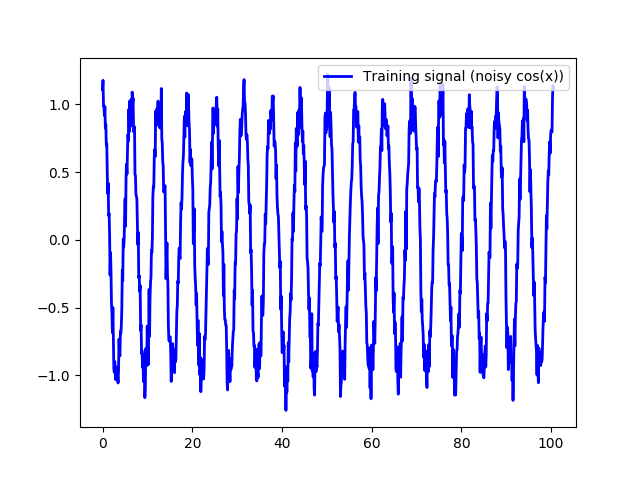

# Building a deep autoencoder with Keras to detect anomalies in data

Here an autoencoder is used to detect anomalies in data. First we create a noisy cosine wave and train a 5-layer autoencoder to reconstruct the wave. Noisy training wave:

Then we inject signals in the wave- here, a large anomaly in one point, and a section of senseless noise in another part of the wave. Observing the reconstruction the autoencoder makes:

We can calculate the reconstruction error pointwise (Euclidian distance in y-values) and also time-average it over a predetermined number of values:

By setting a threshold reasonably above the reconstruction error that the autoencoder makes on the training wave, we can detect anomalies by triggering when the time-averaged reconstruction error breaks the set threshold. We see above that this happens where we injected the signals. 

